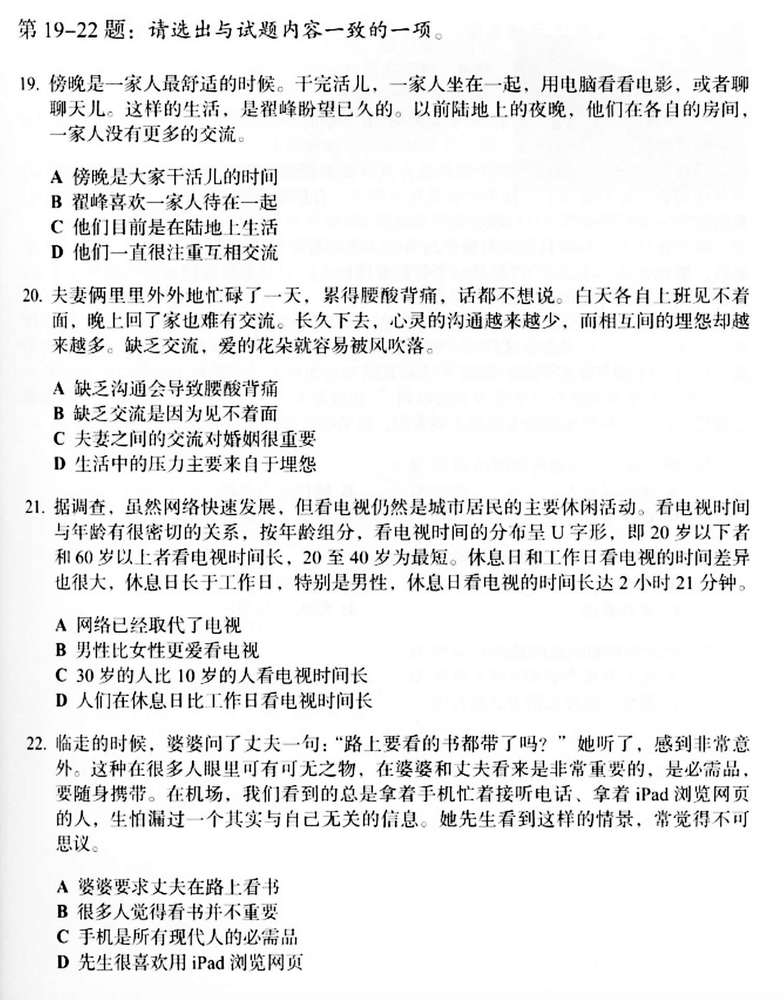

# 二零二零年十一月一號的作業

## 聽力

7. D
8. D？
   1. 我要”kaoyu“ - 這個解釋我不明白。我清楚周末她上課。
9. B
10. D? （我猜-我不知道）
    1.  這個我有問題。不知道很多單詞。
    2.  ye-ban-ma? 有上班關係？yu-yan? 似乎的東西？我聽不懂。在這裏”丁“有什麽意思？
11. B
12. B
13. C
14. D？ (我猜 - 我不知道)

## 閲讀

19. B？因爲我不知道“千完”的意思也可以是A。
    1.  千完 - 是什麽意思？
20. A
    1.  裏裏外外 - 是什麽意思？
21. D
    1.  密切 - osculation (close contact)
    2.  按年 - annually
    3.  年齡組 - age group
    4.  休息日 - day off

22. A? 意味著B和C - A看起來“最對”的答案但是婆婆提醒丈夫携帶書-不幫他看書。
    1.  婆婆 - mother in law (husband's side)
    2.  瀏覽 - to skim
    3.  不可意思 - ? to not make sense?
    4.  感到非常意外 - surprised. 我不清楚-婆婆問丈夫？但是説”她聽了“ - 他是婆婆？但是她問丈夫？誰問誰？
    5.  可有可無之物 - 我必須盯著這個-翻譯差不多是"dispensable"

## 我的筆記

### 我不知道的單詞

- 傍晚 - nightfall/dusk
- 天兒 - Beijing dialect - weather
- 忙碌 - busy bustling
  - 碌 - rough/uneven
