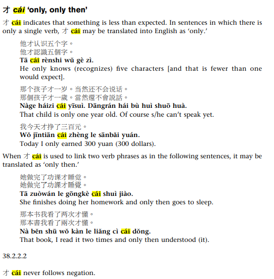

# Using 才

## Resources

[Chinese grammar](https://resources.allsetlearning.com/chinese/grammar/%E6%89%8D)

## Questions

I had only slept for half an hour, and I hadn't slept enough.

~~我才睡一個半小時着, 是睡的不够的~~

    我才睡了半个小时找， 还没有睡够

It wasn't until we walked to the subway station that we realized we had forgotten our umbrellas.

    我们直到走到地铁，我们才注意到忘了我们的伞

    也可以说 （我本来的句子有一点奇怪）

    直到走到地铁，我们才发现到忘了带伞

**This cup is not yours, that cup is yours.**

~~我太太常常说，那个水杯不是你的，是我们的。~~

    这个杯子不是你的，那个杯子才是你的。

He got up late today and didn't go to work until 9:30.

~~今天他起床很晚，九点半才到工作~~

    今天他起床很晚，九点半才去上班

We only get to go out on holidays.

~~才假日而已，我们不出去~~

    我们只有在假期里才出去  

He didn't get home until 10:30 p.m.

~~他十半点才到家~~

    他是点半PM才到家

Why did you just come? We've been waiting for you for a long time.

~~你为什么刚刚才来？我们等你一辈子！~~

    你为什么才来？等了你大半天了。

**I don't care if he comes or not.**

~~我不在乎他来不来~~

    我才不在乎来不来

I just found out about this after watching the news on TV.

~~我才看电视的消息就发现！~~

    看了电视上的新闻，我才知道。

I now understand what you mean by that.

~~直到现在，我才知道你的意思~~

    直到现在，我才明白你的意思

His dad is only 23 years old.

~~他爸爸才二三岁~~

    他爸爸才二十三岁

The other would have been like a baby - 2 or 3 years old

You can't play with your phone until you finish your homework.

~~直到做完你的作业，你才可以玩死亡细胞~~ （这是我的真的目前情况 - 但是我才一个问题）

    你写完作业才能玩手机

He's busy, he's only been here 10 minutes and he's leaving.

~~他很忙，他才是分钟以前来，就要去！~~

    他很忙,才待了10分钟就要走了。

You could drop the 待了 if you wanted