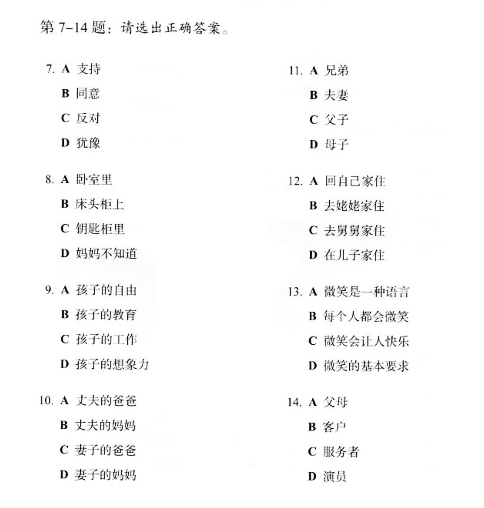

# 2020 Novemeber 10 作業

7. C
8. C
9. B
10. B
11. 我不知道"chengli"是什麽意思。這是關鍵的單詞
12. ？
13. 太難 - 我都不知道。我聽的懂很多單詞但是意思我不懂。太快的

## 問題
- 所以总是跟我们要这要那
- 这种忙我坚决不能帮
- 这要被发现了可不得了
- 您和爸爸今天就在这儿住吧。
- 不行，你又不是不知道，我们从不在城里住

## Transcripts

7.女:这件事你就帮帮她吧。 男:不行，这种忙我坚决不能帮。 女:为什么呢? 男:这要被发现了可不得了。 问:对于给她帮忙，男的是什么态度? 

8.男:妈，你把我的钥匙放在哪儿了? 女:不在你卧室的床头柜上吗? 男:我看了，没有啊! 女:那就在门口的钥匙柜里。 问:钥匙可能在哪儿? 

9.女:孩子的学习你到底管不管? 男:我怎么不管?但是儿子已经这么大了，应该有他的自由。 女:自由能考上大学吗?等他以后考不上大学去扫大街，你就后悔去吧! 男:你这想象力也太丰富了......问:他们因为什么事情吵架? 

10.男:你跟你丈夫的关系不是挺好的吗? 女:原来是挺好的，但从我婆婆来了以后，矛盾就越来越多了。 男:怎么了? 女:婆婆总是说，她一个女人，自己把儿子养大不容易，现在儿子大了，她该享福了，所以总是跟我们要这要那。
  问:婆婆是什么人?

第 11 到 12 题是根据下面一段对话: 
男:妈，您和爸爸今天就在这儿住吧。 女:不行，你又不是不知道，我们从不在城里住。你姥姥、舅舅家都在城里，我们也没住过。
男:我们这不是买了新房嘛?你们又是第一次来。
女:以后我们会常来看你们的。
男:您看，现在都已经这么晚了......
女:没关系，现在走还能赶上最后一班车。
11.说话的两个人是什么关系? 12.妈妈最后的决定是什么? 

第 13 到 14 题是根据下面一段话: 
微笑是人类最美丽的语言。它能够让我们的生活和心情变得愉快。你付出了 微笑，闷热的空气中立刻就有了清风，冰冷的世界里立刻就有了温暖，同时你也 会因此得到快乐。服务者的微笑，表达了对客户最真的情感，所以，对服务从业 人员来说，微笑是最基本的职业要求。 
13.这段话主要想告诉我们什么? 14.根据这段话，谁最应该微笑? 