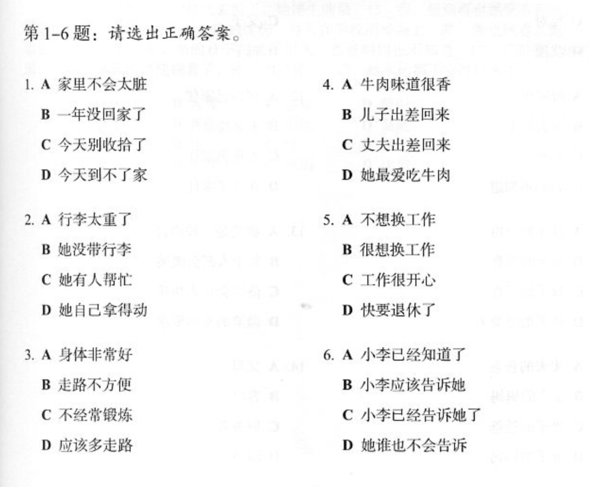

# Listening Practice

**我在括弧裏面寫我不知道的聲音**

1. C （dingxing?)
2. B - 我猜，不知道。（yinqi-wenjian-guzhi）
3. B - 我猜這個應爲我聼到了大學 (qihuile-liangnianle-xingli)
4. ? (今天caizheme-haicuocaixian???)
5. A (jianbao-想要說肩膀？)
6. ？(yijiantaigongzuo??? - 我不知道)

1. C
2. B (管孩子你這麽(xiao? 小？)-nengxiang[something about doing it herself?])
   1. 行李 - luggage
3. B (nian腿脚不好)
4. C（給他（gengdeng???)牛肉）
5. A/B? (gan的不xin???-changli?-beizele?)
6. C (即在他説”小李偷偷告訴我的“我不明白他説什麽)