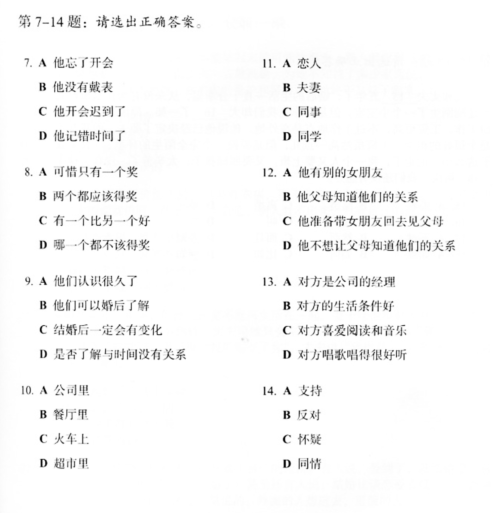

# 怎麽用得

This pattern is used to talk about whether or not you are able to do something. It is subtly different from using 不能 because -不了 usually suggests some external factor out of one's control.

1. 這個字很難寫，我總也不能記住 （對）
2. 我借得了你的筆用一用嗎？（不對）
   1. 我能借你的筆用一用嗎？
3. 考試的時候決不能偷看別人的答案！（對）
4. 這些文件，你們只能在這裏看，拿走不了。（不對）
   1. 這些文件，你們只能在這裏看，不能拿走
5. 有的父母不能教育自己的孩子，就把孩子送到學校去住，讓老師管他們。（不對）
   1. 有的父母教育不了自己的孩子，就把孩子送到學校去住，讓老師管他們。

## Corrections

- 1st one is wrong - Whenever you are unable to achieve something you should use the structure `verb+不`
- If you wanted to say something like "I cannot climb that cliff" you would say `我爬不上那个懸崖。`
- How would you say, "I can't eat so much fruit."
  - 这么多苹果，我一个人吃不了。

## Questions

- Look into 暫時 you can use like now

## Notes

- 七分钟跑一公里，我做不到。
- 生活條件 - living standard or 物质上 (same)
- 樂在其中 - to really enjoy something
- 友人嫁了個公司經理。
  - 娶 - for a man married someone
- 喝彩 - to applaud / be happy for
- 旋律感 - rhythm

## 聽力

7. ~~D~~ C
8. B
9. （我有一點問題聽的懂這個）D
10. （我們XXshiyikuarde?）（那個【什麽？】的。。。？）（那個kaochuangde？）C
11. A
12. ~~C~~ B
13. C? 這個和十四我有問題。
14. 有什麽態度？ - 我不知道。

## 參考資料

[Advanced uses of "zong"](https://resources.allsetlearning.com/chinese/grammar/Advanced_uses_of_%22zong%22)

[Advanced Potential Complements](https://resources.allsetlearning.com/chinese/grammar/Advanced_potential_complements)

[Comparing "hui," "neng," "keyi"](https://resources.allsetlearning.com/chinese/grammar/Comparing_%22hui,%22_%22neng,%22_%22keyi%22)

[決 - certainty](https://www.mdbg.net/chinese/dictionary?page=worddict&wdrst=1&wdqb=%E6%B1%BA)
