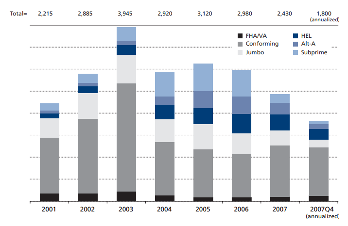

- The total volume of mortgage lending dropped after 2003, to around $3 trillion a year in 2004-06, but the share of subprime and home equity lending expanded greatly. Prime mortgages dropped to 64 percent of the total in 2004, 56 percent in 2005, and 52 percent in 2006, meaning that nearly half of mortgage originations in 2006 were subprime, Alt-A, or home equity.

- Greenspan and Kennedy (2007) estimate that homeowners extracted $743.7 billion in net equity from their homes at the peak of the housing boom in 2005 — up from $229.6 in 2000 and $74.2 in 1991
- There was a deterioration in lending standards generally dated to 2004 or 2005. Families that lacked the income and down payment to buy a house under the terms of a conforming mortgage were encouraged to take out a mortgage that had a very high loan-to-value ratio, perhaps as high as 100 percent (often using second or even third mortgages), meaning that they started with no initial equity — and thus no true financial stake — in the house. Such borrowing typically requires a rather high interest rate and high monthly payment, one that likely violates the usual rules on the proportion of household income needed to service the debt. Originators got around this problem by offering Adjustable Rate Mortgages (ARMs), which had low initial payments that would last for two or three years, before resetting to a higher monthly amount. These so-called "teaser" interest rates were often not that low, but low enough to allow the mortgage to go through. Borrowers were told that in two or three years the price of their house would have increased enough to allow them to refinance the loan. Home prices were rising at 10 to 20 percent a year in many locations, so that as long as this continued, a loan-to-value ratio of 100 percent would decline to 80 percent or so after a short time, and the household could refinance with a conformable or prime jumbo mortgage on more favorable terms.