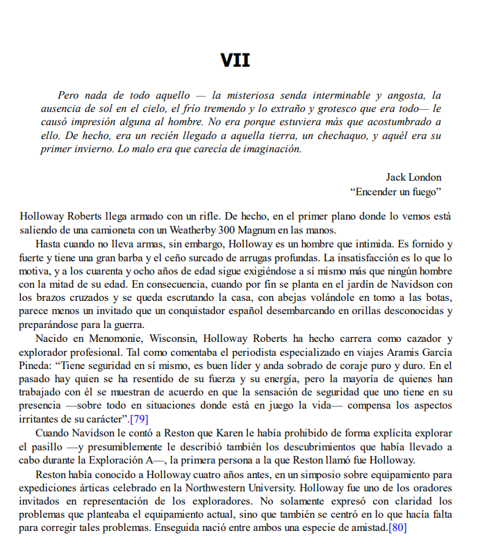

# La Casa de las Hojas / 葉子的傢

## Original

## Texto

> Pero nada de todo aquello — la misteriosa senda interminable y angosta, la ausencia de sol en el cielo, el frío tremendo y lo extraño y grotesco que era todo— le causó impresión alguna al hombre. No era porque estuviera más que acostumbrado a ello. De hecho, era un recién llegado a aquella tierra, un chechaquo, y aquél era su primer invierno. Lo malo era que carecía de imaginación.
>
> \- Jack London, "Encender un fuego"

Holloway Roberts llega armado con un rifle. De hecho, en el primer plano donde lo vemos está saliendo de una camioneta con un Weatherby 300 Magnum en las manos.

Hasta cuando no lleva armas, sin embargo, Holloway es un hombre que intimida. Es fornido y fuerte y tiene una gran barba y el ceño surcado de arrugas profundas. La insatisfacción es lo que lo motiva, y a los cuarenta y ocho años de edad sigue exigiéndose a sí mismo más que ningún hombre con la mitad de su edad. En consecuencia, cuando por fin se planta en el jardín de Navidson con los brazos cruzados y se queda escrutando la casa, con abejas volándole en tomo a las botas, parece menos un invitado que un conquistador español desembarcando en orillas desconocidas y preparándose para la guerra.

Nacido en Menomonie, Wisconsin, Holloway Roberts ha hecho carrera como cazador y explorador profesional. Tal como comentaba el periodista especializado en viajes Aramis García Pineda: “Tiene seguridad en sí mismo, es buen líder y anda sobrado de coraje puro y duro. En el pasado hay quien se ha resentido de su fuerza y su energía, pero la mayoría de quienes han trabajado con él se muestran de acuerdo en que la sensación de seguridad que uno tiene en su presencia —sobre todo en situaciones donde está en juego la vida— compensa los aspectos irritantes de su carácter”.[79]

Cuando Navidson le contó a Reston que Karen le había prohibido de forma explícita explorar el pasillo —y presumiblemente le describió también los descubrimientos que había llevado a cabo durante la Exploración A—, la primera persona a la que Reston llamó fue Holloway.

Reston había conocido a Holloway cuatro años antes, en un simposio sobre equipamiento para expediciones árticas celebrado en la Northwestern University. Holloway fue uno de los oradores invitados en representación de los exploradores. No solamente expresó con claridad los problemas que planteaba el equipamiento actual, sino que también se centró en lo que hacía falta para corregir tales problemas. Enseguida nació entre ambos una especie de amistad.

## 翻譯

> 然而，所有這一切 - 無窮和神秘的小徑，天空中缺乏陽光，嚴寒以及一切的丑怪和可怕- 對這個人造成了一些印象。這不是因為他已經習慣了這一切。事實上，他是這片土地的新來者，一個新手，而這是他的第一個冬天。問題在於他缺乏想像力。
>
> \- 杰克·倫敦，《生火》

霍洛威·羅伯茨帶著一把步槍出現了。事實上，在我們第一次看到他時，他正從一輛卡車上拿著一把威比300麥格農步槍下來。

即使沒有武器，霍洛威也是一個令人生畏的男人。他身材魁梧強壯，留著一大把鬍子，額頭深深皺紋。他的不滿驅使著他，在他四十八岁的年龄，他对自己的要求仍然超过了年龄不到一半的任何男人。因此，當他站在納維森的花園裡，雙臂交叉，凝視著房子，腳邊飛舞著蜜蜂，他看起來不像是一個客人，而更像是一個西班牙征服者登陸在未知之岸並準備戰鬥。

在威斯康辛州的梅諾莫尼出生的霍洛威·羅伯茨一直從事獵人和專業探險家的職業。正如旅行記者阿拉米斯·加西亞·皮內達所說：“他對自己充滿自信，是一個優秀的領導者，並且具有純粹而堅韌的勇氣。過去有些人對他的力量和能量感到不滿，但大多數與他共事的人都認為，他的存在給人一種安全感，尤其是在生命受到威脅的情況下，這種安全感彌補了他性格上的一些刺激之處。”

當納維遜告訴雷斯頓，卡倫明確禁止他探索走廊，並且可能還向他描述了他在A探索期間的發現時，雷斯頓第一個打電話的人就是霍洛威。

雷斯頓在四年前於西北大學舉辦的北極探險裝備研討會上與霍洛威相識。霍洛威作為探險家的代表，受邀成為演講嘉賓之一。他不僅清晰地表達了當前裝備的問題，還重指出了解決這些問題所需的措施。兩人之間很快建立起了某種友誼。
