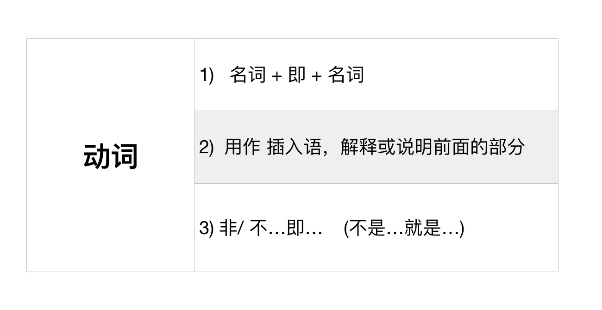

# 即

## 名词 + 即 + 名词

This is 就是的意思

    暹罗即现在的泰国

也可以加一個是：即是

    暹罗即是现在的泰国
    山的后面即是军队的驻地。

## 用作 插入语，解释或说明前面的部分

    中国建国后第一年，即1950年，我们家乡有了第一所中学。

## 非/ 不。。。即。。。

    非此即彼 (either or question)

    非黑即白
    这个世界从来不是 非黑即白 的

## 就

第一，表示动作在很短时间内 立即发生或者 在某种条件下 立即发生。

    考试结束后，我即赶回家中 （就的意思）
    服药两三天后即可见效 （就的一次）

## With time word

    大雨凌晨即止。(here it means 到了凌晨大雨會停下來)

## 願望的副詞

    以上问题盼即答复 (When used as an adverb for a word relating to hope it indicates that you want something to happen very quickly. 立即/馬上的意思)

## 一。。。即。。。

## 