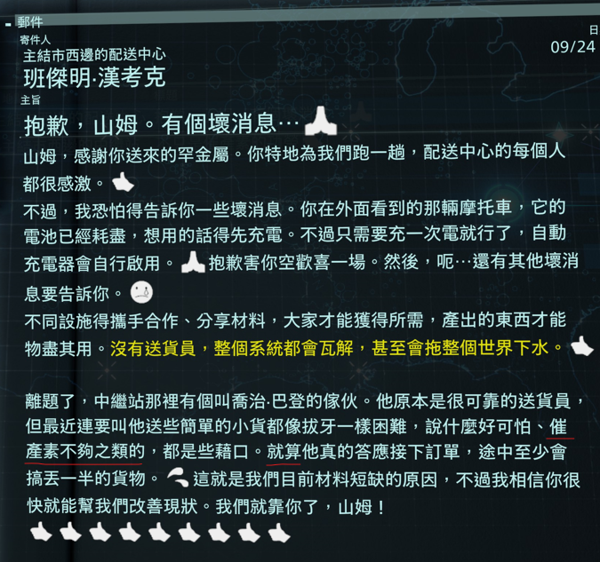

催產素 = oxytocin
説什麽 = "[He] said something like"
就算=即使 = 完全一樣

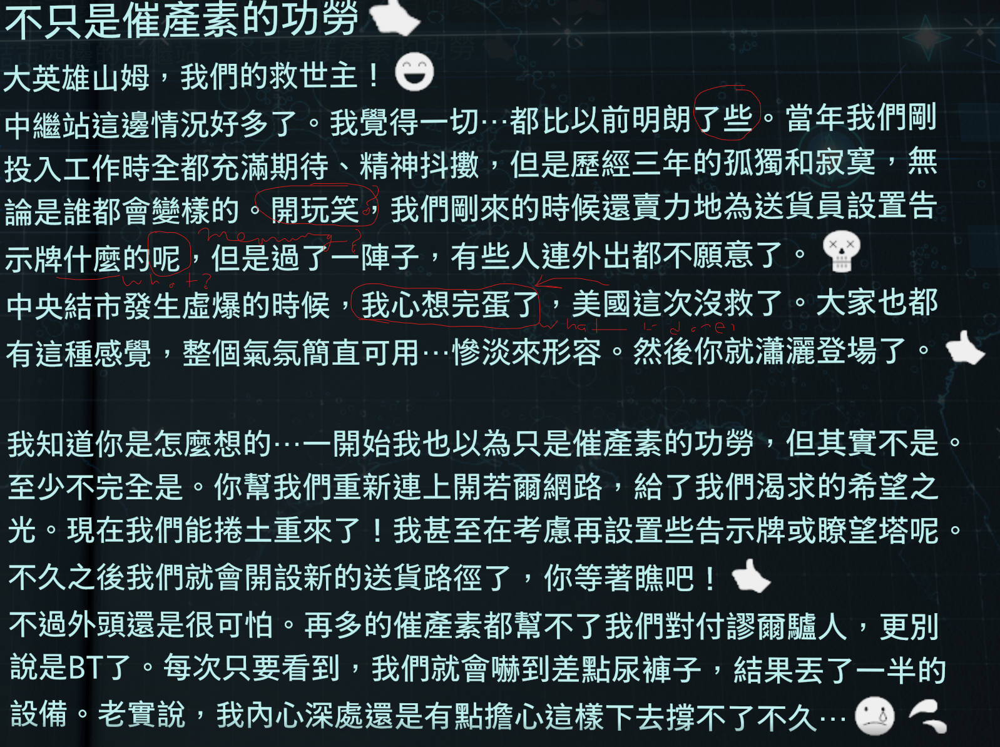

我什麽時候能用這個結構

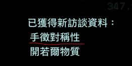

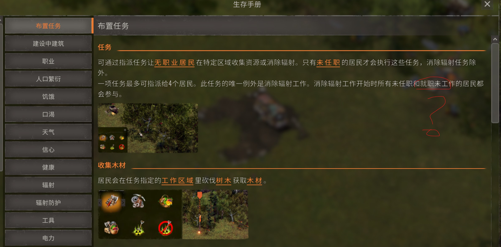

## Deathloop

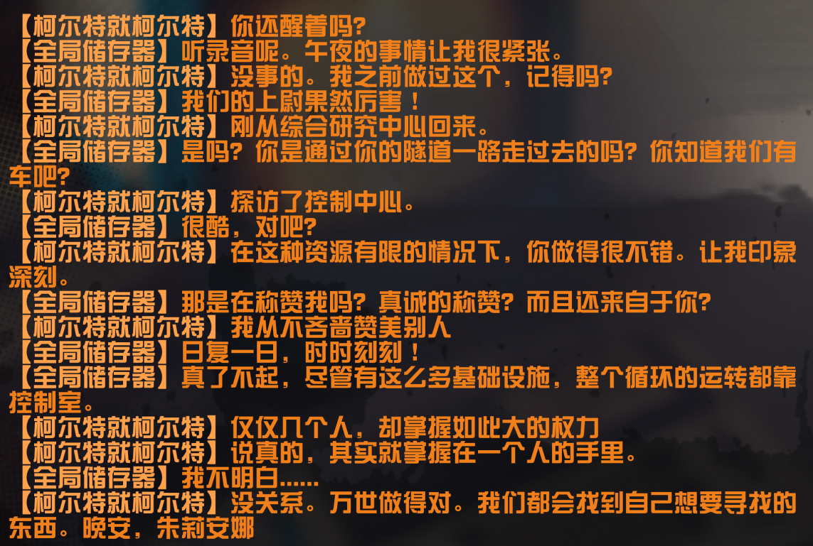

中心=
時時刻刻 = at all times (here all day every day)

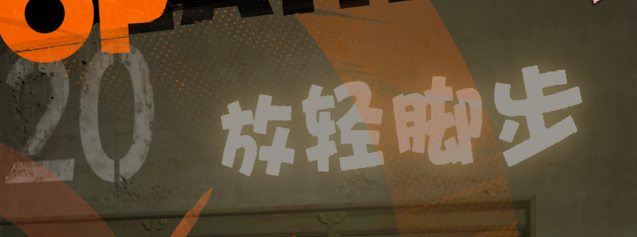

放輕脚步

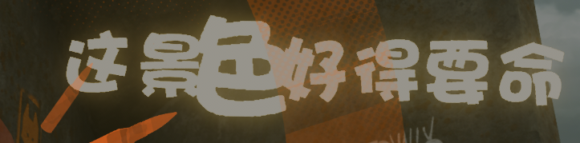

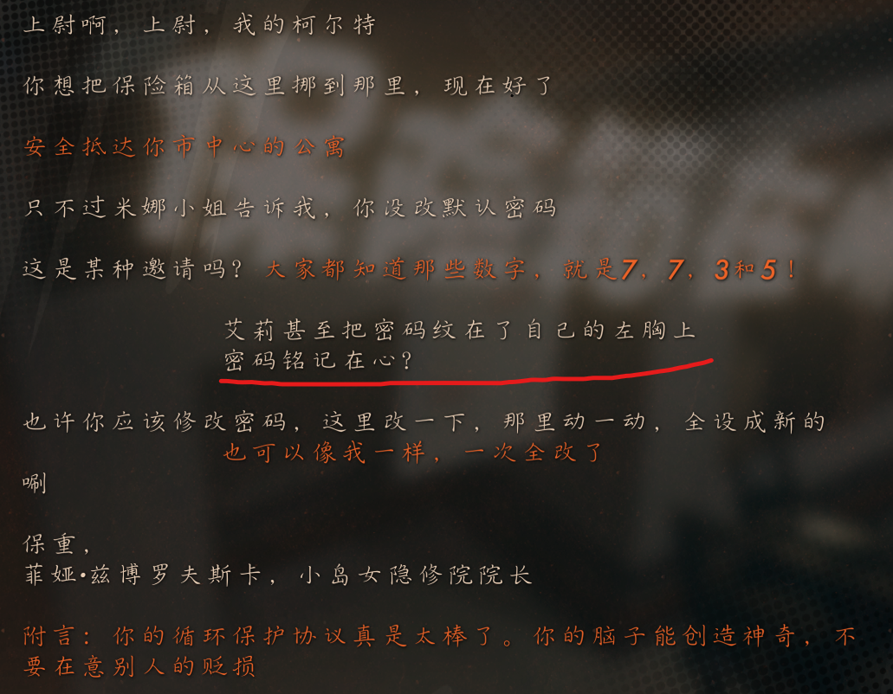

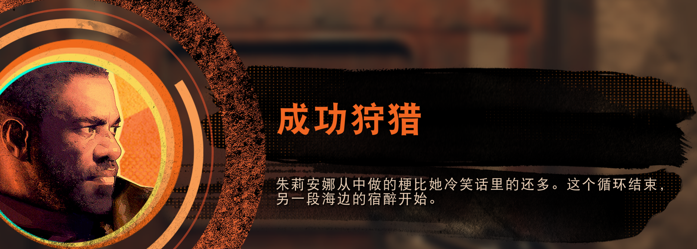 

梗 here is an obstacle 成工作梗 is a common phrase

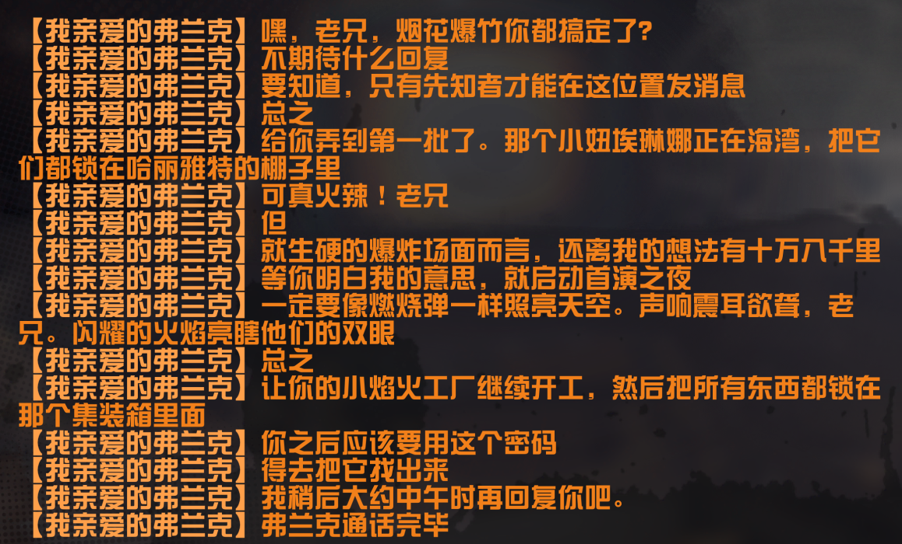

dd

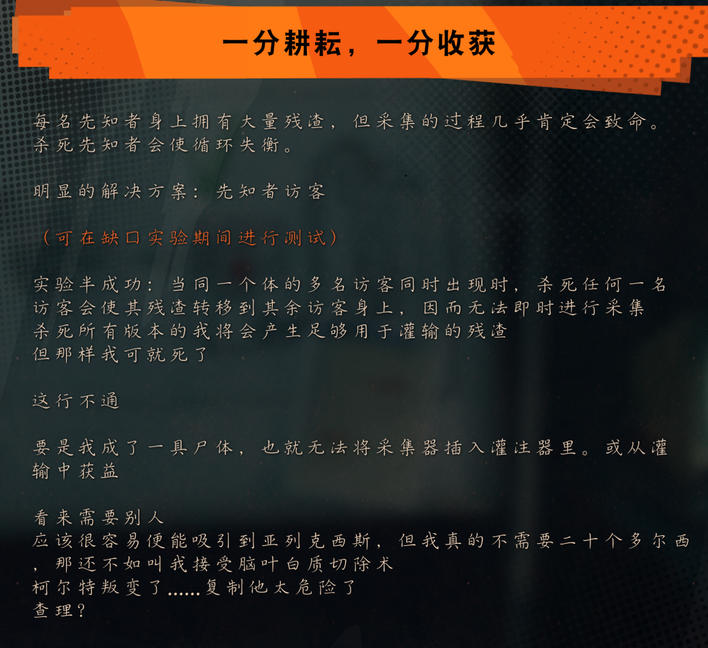

方案 = plan, but it's an enumerated plan whereas 計劃 is just like, "I plan to go to the park tomorrow"

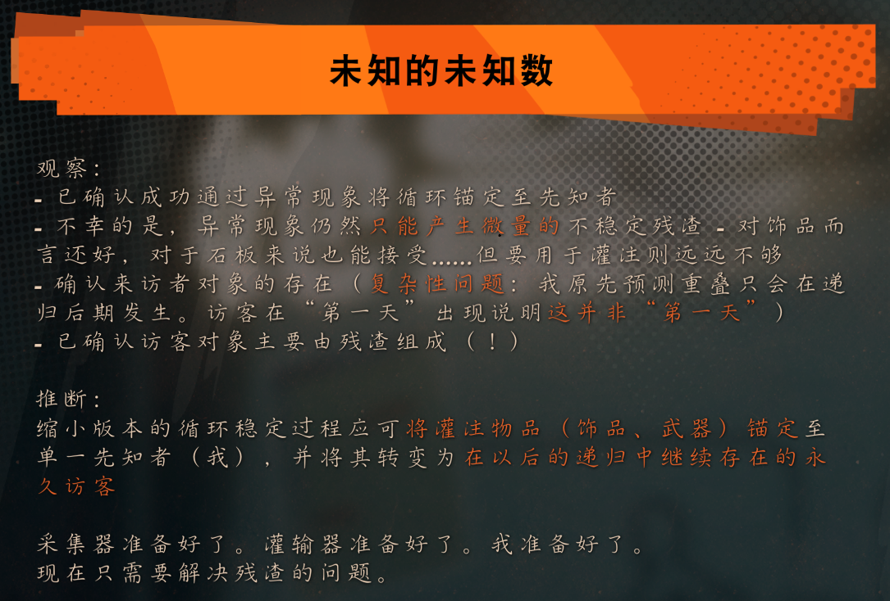

主要 = mainly

----------------------------------

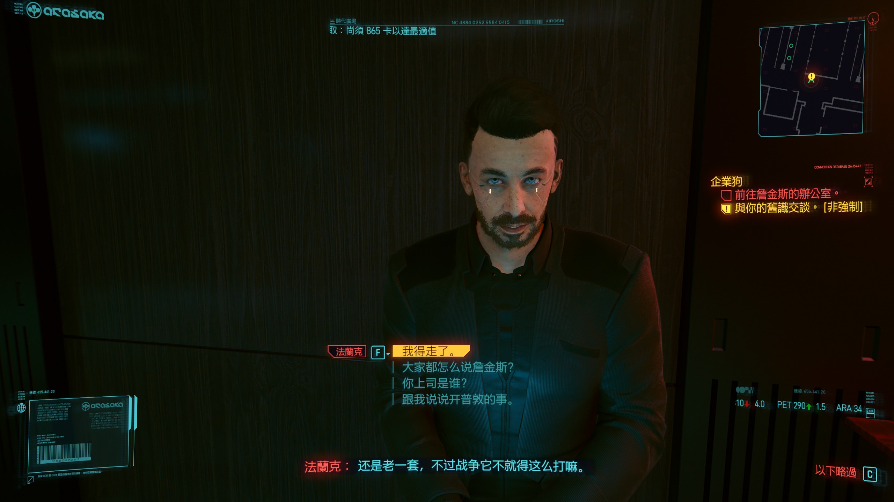

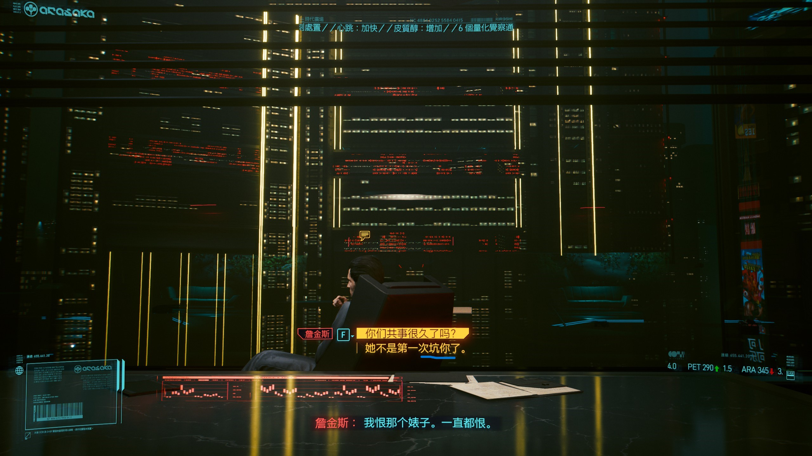

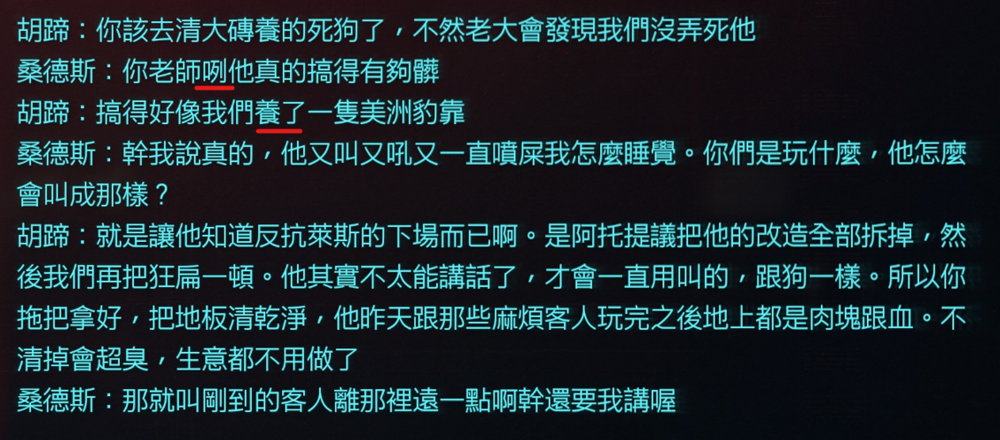

