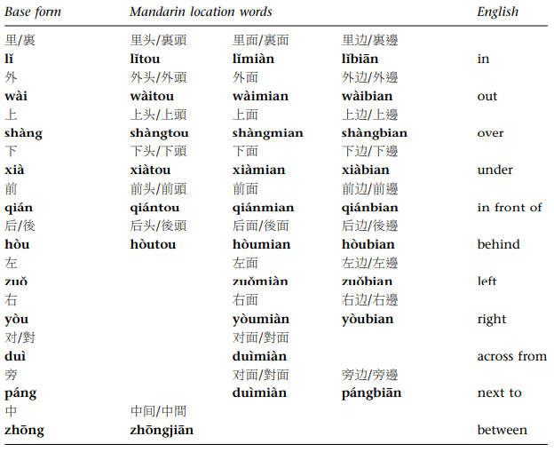

# Expressing Location and Distance

1. In traditional characters, the character 裏 lm is also written as 裡.
2. The choice of suffix is determined by the region of China and the personal preference of the speaker.
3. Mandarin has a second word for ‘in,’ 内 nèi. 内 nèi does not occur with suffixes and has very restricted in usage. It is used in fixed expressions such as:

国内 / 内部 /内人 (my wife)

##　Expressing Near and Far

###　Far

    我家里图书馆很远 (without 离)
    我家离这里很远 (with)

### Close

    学校（很）近 (without 离)
    公园离学校很近 （with）

### Specific Distance

    公园离图书馆（有）三公里(路)

## Distance Words

    里 Chinese mile (.5 km)
    公里 kilometer
    米 meter
    英里 english mile
    哩 english mile

##　Asking　About　Distance

### General Distance

    你家离图书馆远吗？
    你家离图书馆进吗？

### Specific Distance

    你家离图书馆多么远？

or

    你家离图书馆有多么远？

###　Note

As in English, the question ‘is it far?’ is more neutral than the question ‘is it close?’ When the speaker asks ‘is it far?’ he or she typically does not necessarily expect the answer to be ‘far.’ However, when the question is ‘is it close?’ the speaker often expects the answer to be ‘close.’

## Getting Closer

You can also say something like 圣诞天越来越近

## Non Distance Events

You can use it for events and things not just distances.

    离考试的日子越来越近，他也变得紧张起来。

## With Adjectival Clause

You can also use adjectival clauses

    这是一朵离我最近的花。
    这是一朵花。这是一朵（离我最近的）花。

## Specifying Location of an Object by Distance

    离这家银行不远的地方,有一个地铁站。
    离我家1公里的地方，有一家我很喜欢的咖啡店
    他在离机场10公里的地方遇到了交通事故

## Specifying Distance by Time in Transit

从我家到机场，搭 (or 坐) 车要一个小时。(I am an hour from the airport)

If you want to say (the speaker) thinks it's fast you could say: 从我家到机场，坐车一个小时就到了。

If you want to emphasize that something is slow you could say: 从我家到地铁站，走路要四十分钟

## Other

我本来应该知道 (I should have known)

打发我的空闲时间 (spend time)

