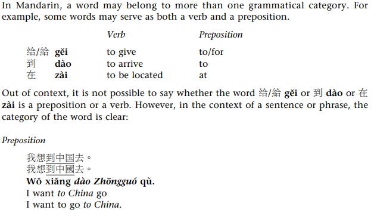
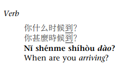

# Grammar Terms

## Compliments

Complements are verb phrases that serve as the object of a verb. Modal verbs require
complements, as do many other verbs.

他會*説中國話*

## Predicates

The predicate of a sentence includes a verb and any object(s) or complements of the verb. It may also include negation, adverbs, prepositional phrases, and phrases that indicate time when, duration, or frequency.

Another way to look at this is that the predicate consists of everything in the sentence except for the topic and the subject.

## Prepositional Phrase

Prepositional phrases consist of a preposition and its following noun phrase. In
Mandarin, the prepositional phrase always precedes the verb phrase.

我*在家*吃飯

## Topics

Generally speaking, the topic is the noun or noun phrase that the sentence, paragraph,
or narrative is about. The topic occurs at the beginning of a sentence, and is often
distinct from the subject.

*中國菜*，我特別喜歡其家常豆腐

In Mandarin, the object of the verb may sometimes occur in ‘topic’ position, at the
beginning of the sentence, before the subject.

*羊肉*，我不太喜歡吃

## Verbs

### Modal Verb

Modal verbs are verbs that express ability, permission, or obligation, for example
會 "can" (mentally able), 能 néng "can" (physically able),  kéyi ‘may’ (have
permission),  得 dei ‘must/have to.’ Modal verbs can serve as the one word answer to
yes–no questions, but in complete sentences they are always followed by a verb
phrase complement.

### Verb Phrases

The verb phrase is the verb and its noun phrase objects and/or verb phrase complement clauses.

她每天*看電視*
爸爸*給我錢*
太*會開車*

## Gramatical Category Shift

