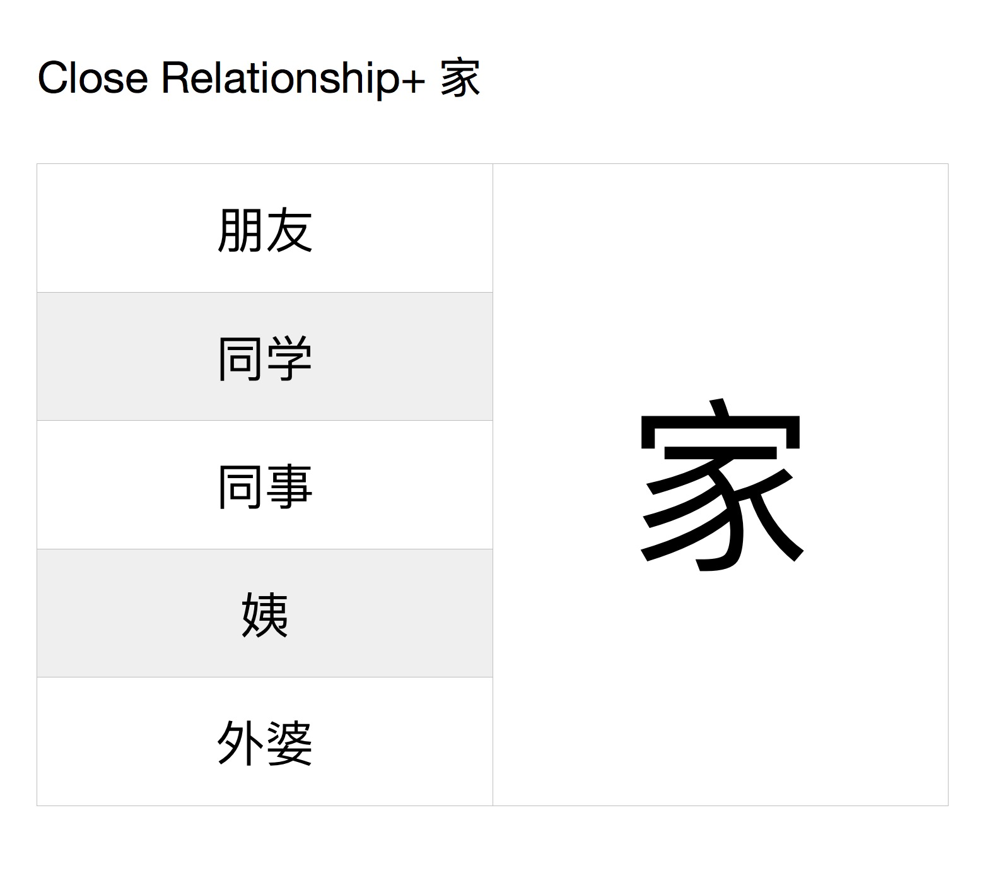
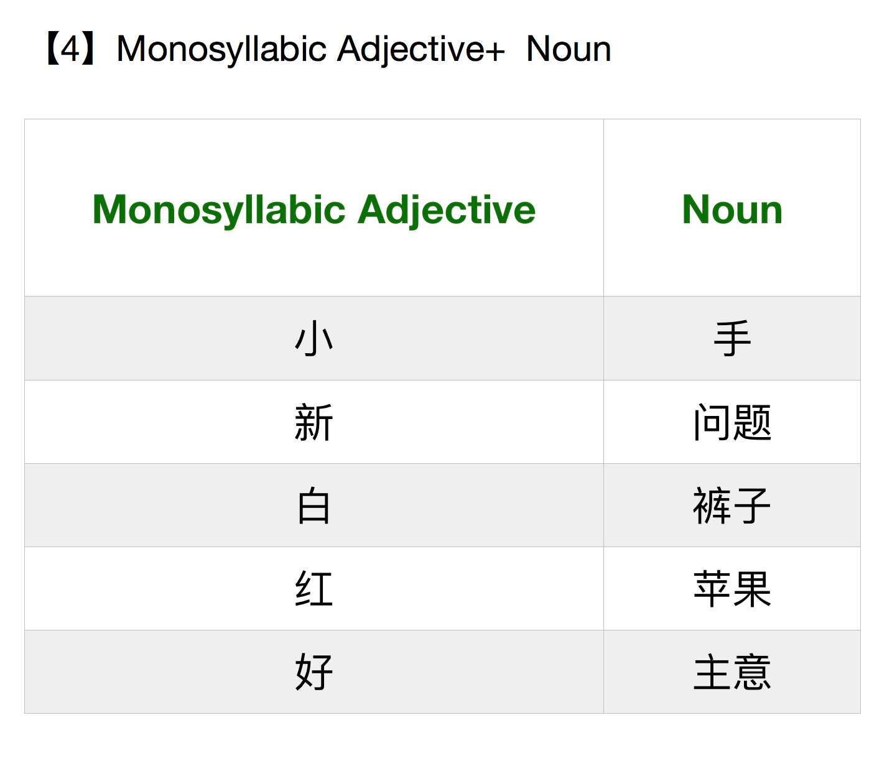
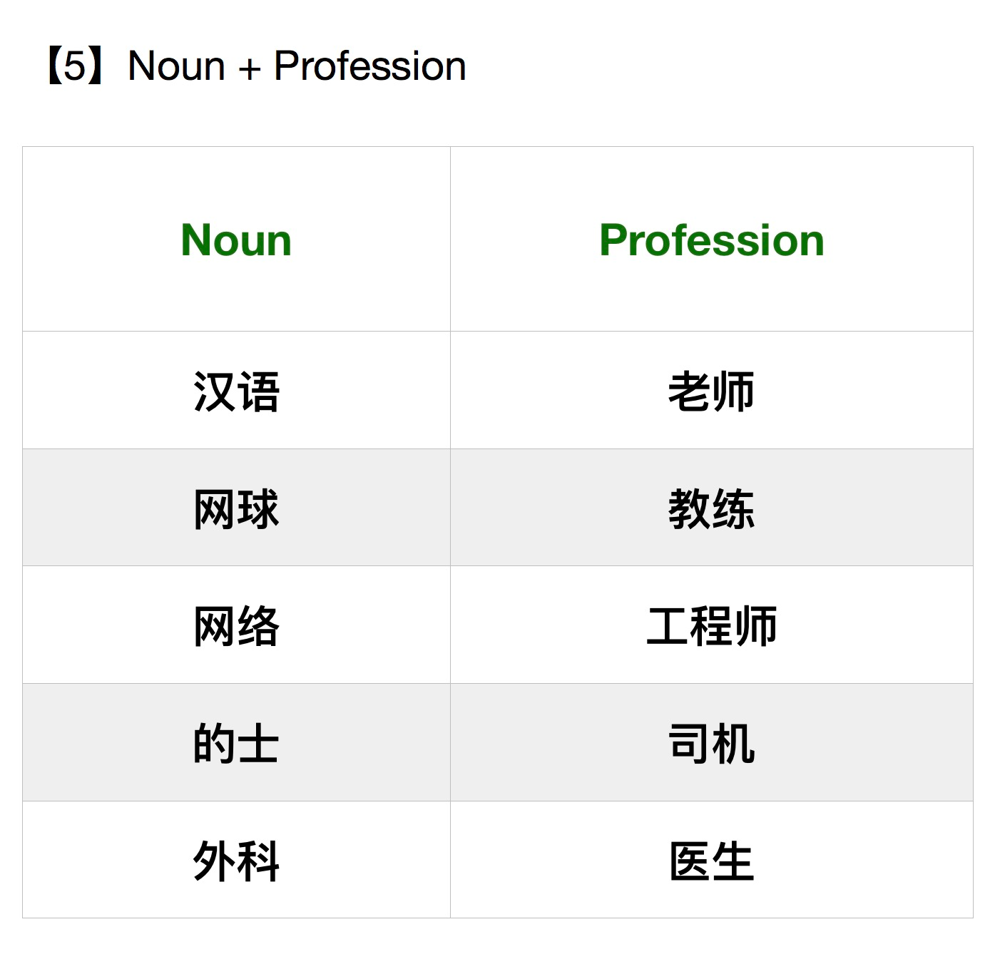

# Ommitting 的

There are some very subtle differences. For example, if you say 我们图书馆 it means you are employees of the library. However, if you say 我们的图书馆 it means that you own the library (or something like that)

外婆家 = 

我不是三岁小孩了

to visit = 看望

You can also just say 看

访问 - is like to visit a country or something like that, but it can't be person

