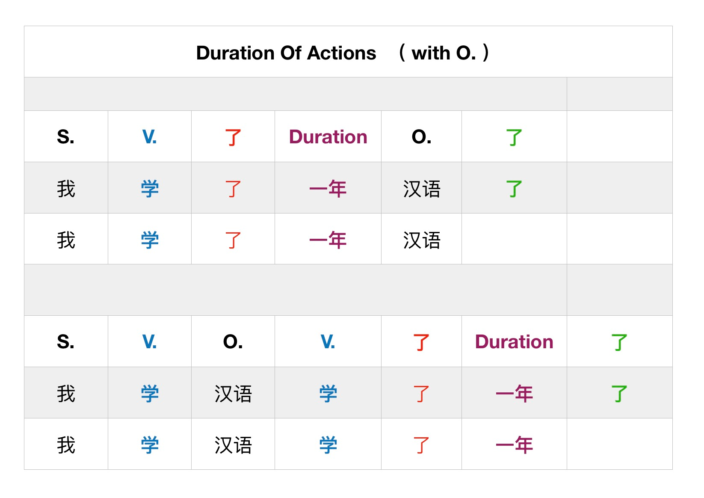
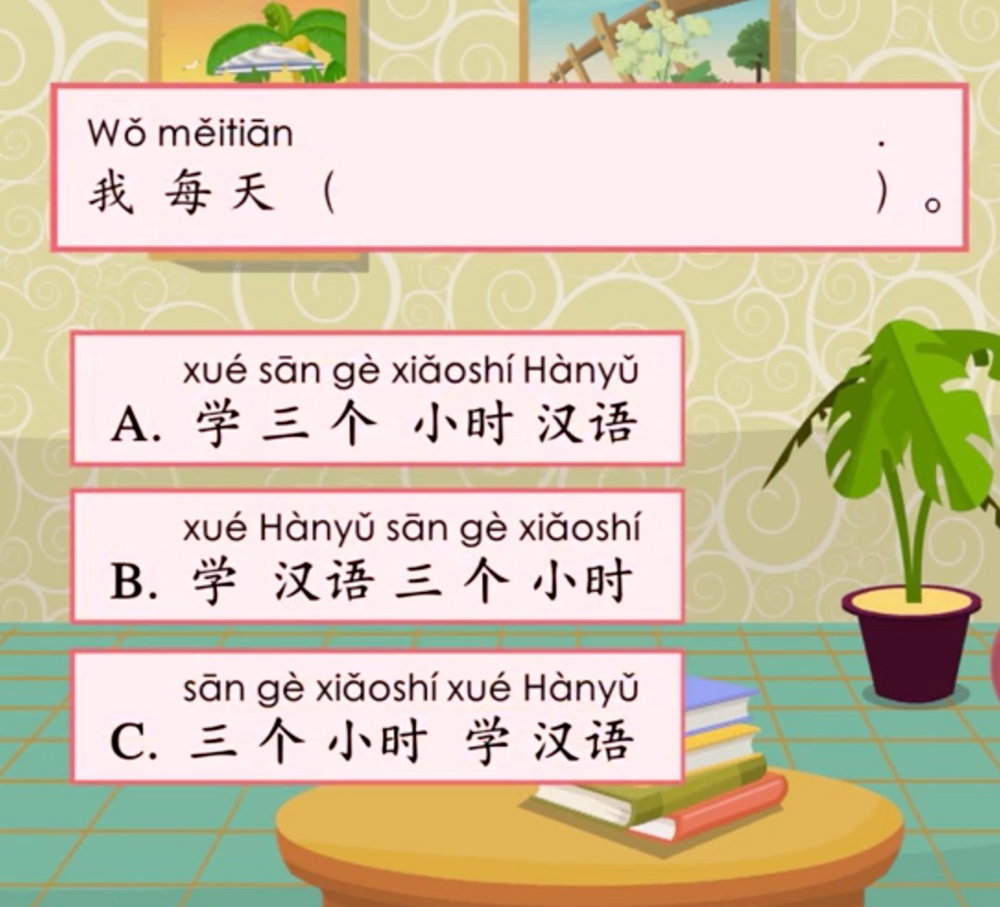
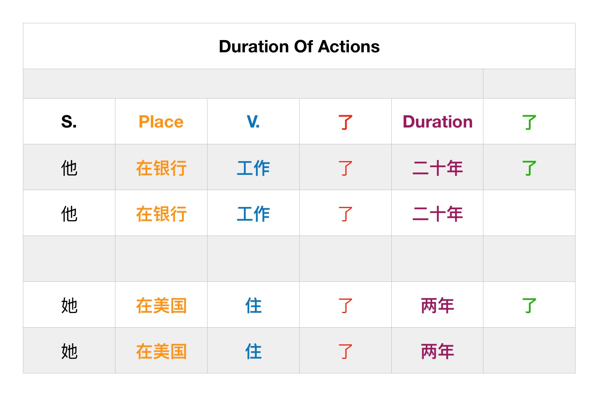
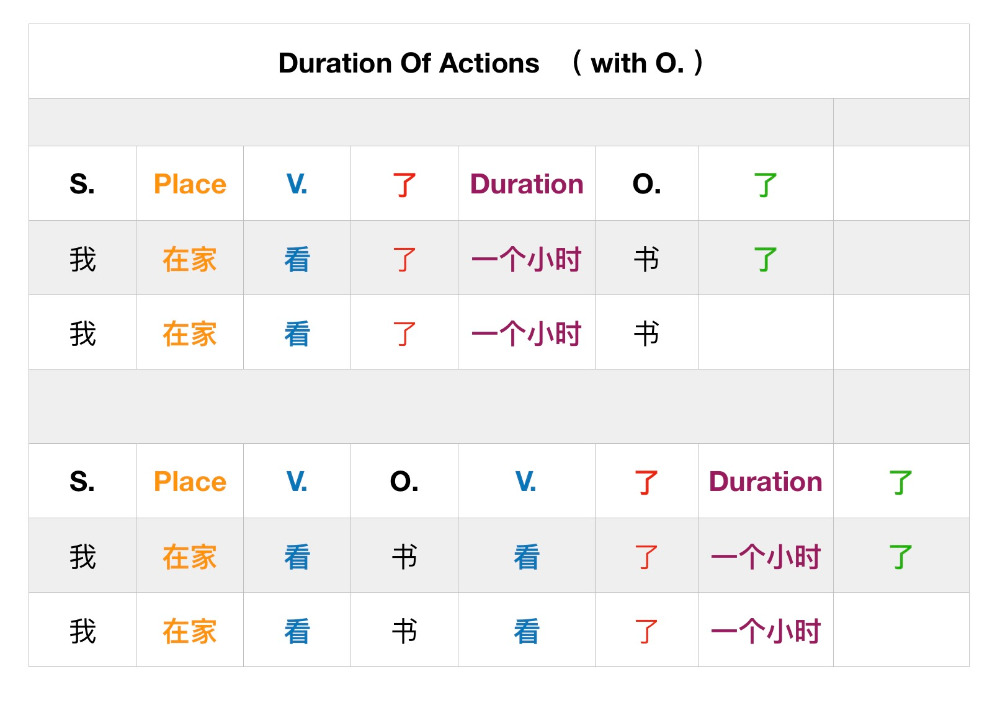

# Time and Duration Lesson

This is the structure:

Correct sentences:
- 昨晚我睡了十个小时（觉）
- 昨晚我睡觉睡了十个小时。

Answer: A

If you have a location it is interchangable with a time word (yesterday, today, etc):
- 主语 + 时间名词
- 时间名词 + 主语
  
Are both correct

### Time Words
时间名词 = when
时长 = duration

### Corrected sentences
- 我在网上上了五十分钟中文课了
- 我在网上上中文课上了五十分钟了。

### Difference between 等待 and 等
等待 （东西 - 不可以是人）
等 （东西 或 人）

## 作业

[作业](../../作業/2020-Dec-15%20Time%20and%20Duration/README.md)