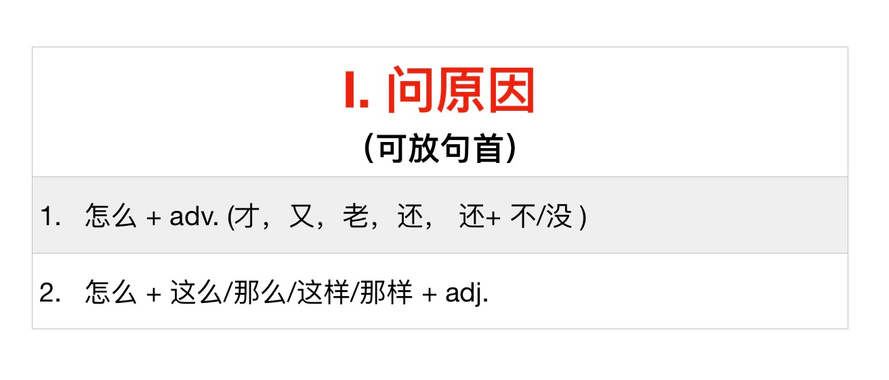

##　zenme as  why

## zenme as a question word asking for reason

It can also mean adjective
怎么 + adv. (才，又，老，还， 还+ 不/没 )

fuzi = adverb

怎么 + 才  
你怎么晚上才做作业？

你怎么老是去他家吃饭？ 
Here 老 means obviously (经常). Why do you always go to his house to eat?

怎么 + 又  
你怎么又迟到了？ 
Why did you arrive late again?

这么晚了，你怎么还不睡觉？ 
Why aren't you asleep yet?

### When used with an adjective （形容词）
怎么 + 这么/那么/这样/那样 + adj. +（ 呢）？

中国菜怎么那么好吃呢？ 
here 那么 is an adverb 副词

怎么中国菜那么好吃呢？ 
中国菜怎么那么好吃呢？

这么晚了，怎么你还不睡觉？ 
这么晚了，你怎么还不睡觉？ 
these are both acceptable  
you can move it around

###　When you can and cannot use

You should use it when you feel something is a bit odd or informal situations.

Here you could not use it. You're just asking for a fact.  
怎么 天空是蓝色的？

Here you could because you're expressing surprise. You provide a determiner (限定词) because it's possible it is only this part of the sky.  
怎么那片天空是紫色的？

## 怎么 as how

这道菜是怎么做出来的？ 
How do you make this dish?

###　Changing it to 为什么
你怎么做了这道菜？ 
You can add a 了

###　With　个

怎么个 + 动词 + 法  
这道菜是怎么个做法？

这个游戏怎么个玩法？ 
This is the same as saying  
这个游戏是怎么玩的？

这个游戏是怎么玩的？怎么：状语

这个游戏是怎么个玩法？ 怎么：定语  
Here you have added a noun 玩法 so you need a classifier 个  
这个游戏是怎么个玩法？ 定语（怎么个） +  名词  
Here we omit the number word  
这个游戏是怎么（一）个玩法？ 

## 心理活动 (mental activities) - 说话的人想什么

这让我怎么说呢？ 
There's not a good way to translate this. The sceanario would be someone says something to the speaker, the speaker means with this, "I'm not sure what to say."

你总是迟到，老板会怎么想呢。 
怎么 + 想，看，考虑，说

这件事情，你怎么看？ 
What do you think of it?

你真的要辞职吗？你是怎么考虑的？ 
You really just resigned? How did you decide to do that? (It doesn't really directly translate but it's asking about your reasoning/mentality)

##　Ask further about the intent

A： 你的生日是什么时候？  
B： 怎么？要送我生日礼物吗？  
Why - do you want to send a birthday present?

A:这么冷的天你怎么穿这么少？  
B: 穿得少怎么了？  
Why do you ask

## What is wrong

Sub. + 怎么了？ 
怎么啦 ？

A: 就你们这样做菜的水平还开饭店呢？ 
B: 怎么啦？怎么啦？先生，出啥事啦？ 
(what happened)

##　Rhetorical Question

这件事是她处理的，她怎么不知道这件事处理的结果呢？

你的汉语这么好，怎么没通过HSK二级呢？
How did you not pass HSK 2

你怎么能这样对我？

吃这么多，你怎么能不胖？

##　泛指/ 任指

泛指/ 任指 - these mean to use in a general sence or with an indefinite/general denotation

不管你怎么求我，我都不会答应你的要求的。
（不管/ 无论） +  怎么 +（都/也）
你怎么都要交作业啊。
父母怎么也不会让孩子受伤的。 - No matter what the parents cannot allow the child to be harmed
无论他怎么唱都跑调。- No matter what he does he sings out of tune
你怎么想的就怎么说吧。- Whatever you think, you should say
你想怎么写就怎么写吧。

## 不怎么+ adj. / verb

我今天不怎么高兴。
不怎么= 不太

## 习惯用语

怎么 + （一）回事
怎么 + （一）个人

大家这么高兴，这是怎么（一）回事？
Everyone is so happy, what happened?

他是怎么一个人？
What kind of person is he?

## Other

疑问词 = question words. For example 哪里，什么，谁。。。
如果我想学容易的，我就会学法语 - If I had wa

## 复习的问题

1. 你明天不是要早起吗？（打游戏）
   
        你怎么还在打游戏？
        你怎么还在打游戏呢？

2. 你明天不是要早起吗？ （睡觉）

        你怎么还不去睡觉？
        你怎么睡不着？

3. 你这个月已经迟到三次了！（迟到）

        你怎么又迟到了？

4. 我找遍了整个房间， （手机）。

        怎么也找不到我的手机。

5. 这个字我不认识， ？（告诉，读）

        你能告诉我怎么读吗？

6. 停水了，晚上我们 怎么洗澡？

        停水了，晚上我们 怎么洗澡？

7. 这首曲子我已经弹了两天了，但是 （弹不好）

        这首曲子我已经弹了两天了，但是 怎么也 弹不好

8. 前面路口有那么多人， ？（回事）

        这是怎么（一）回事？

9. 天气太热了，家里又没空调， （睡不着）。

        我怎么都睡不着

10. 这个游戏你玩过吗？ （怎么个，玩）

        是怎么个玩法？
        怎么个 + verb + 法