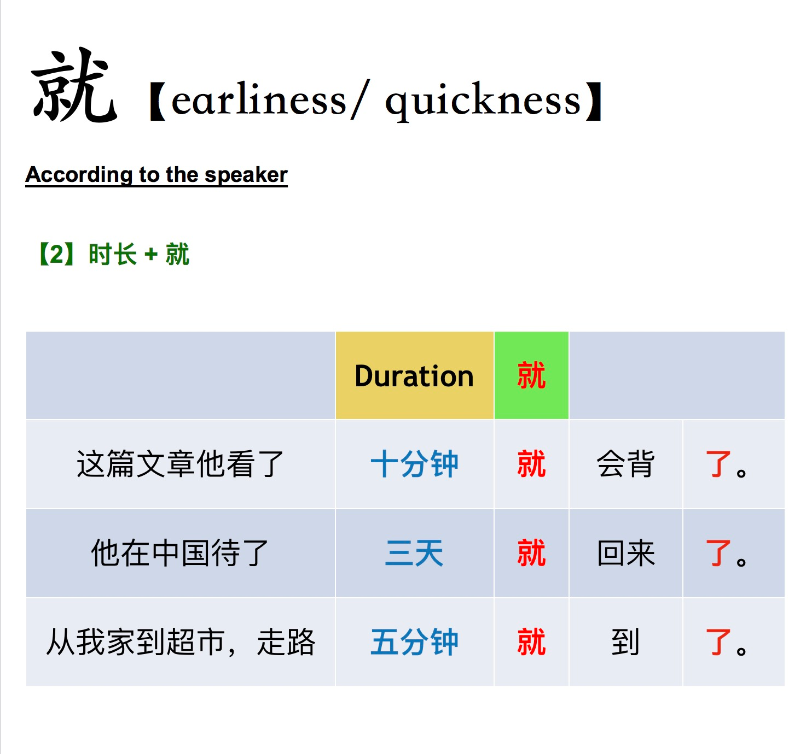

The first two the meaning is that four people is a lot for one room. The third one is that the room must be huge to fit four people.

He only wanted three tickets, he did not want more.
In the second one it's saying there are few left. 张 here is a measure word.
Depending on where you emphasize the sentence it changes the meaning. In the first one it means three is not many - in the second it means it is a lot.
In the forth one it means he already spoke for two hours, nobody else will have time to speak. The third one it means only and the forth one it means already.
Note:
他就要了三张票。
他（一个人）就要了三张票

If the measure word is at the end and you emphasize the measure word the quantity is small.

If the quantity is small and the measure word is at the end then you can use jiu and cai are identical in usage.

读书 - it can also mean to go to school

You're just adding extra emphasis that it is this person. For example if you were looking at a photo with lots of people you coould use this to indicate that it is this person in particular.
【一】

1.就是！ 你说的一点也没错！
2. 就是，就是， 我也这么认为。

【二】

1. 这孩子就是喜欢邮票， 不喜欢别的。

2. 这家店就是西服漂亮， 裙子不怎么样。

3. 这孩子就是可爱。

4. 不发烧， 就是难受。

5. 情况就是这样。

【三】

1.不去， 我就是不去！

2. 他学中文很认真， 一学就是一个下午。

3. 不是把老虎打死， 就是被老虎吃掉。

4. 这样吧， 我早去早回就是了。

5. 他伸手就是一巴掌。

6. 他走过去就是一脚。