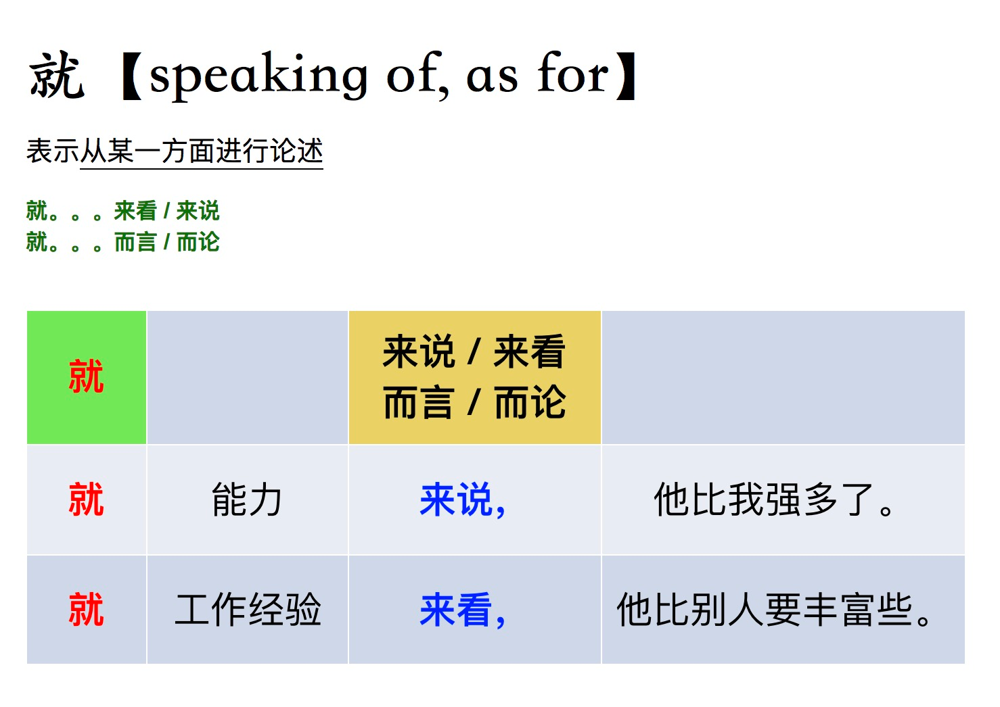

## When you can use it
You can use with it with things that require time to progress (持续性的):
会议，谈判，实验

我们进行了一个实验。
对这个问题，我们进行了实验。
就这个问题，我们进行了实验。
进行了商业合作持续性的
你可以通过电子邮件和客户进行交流。

## When you can't use it:

Daily activities:
日常行为 不能用 进行

Short things:
进行 叫喊 （X）