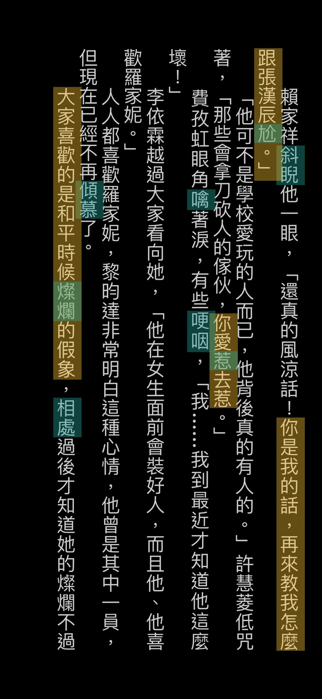

- noun + 有什么 + adj. + 的+（吗）？
- 你有什么好吃的吗？

- When using this type of 再 the meaning is that your friend's tried to leave the house, but then you suggested they stay for food and then afterwards they can leave.
- 我们看完这部电影再走吧。
- 你们吃了饭再走吧。
- 一个动作发生在 另一个动作 
- 结束之后 动作1： 
- 吃饭动作2： 走

- 引起注意你爱惹（就）去惹。（如果）你爱惹（他们）（就）去惹（他们）。