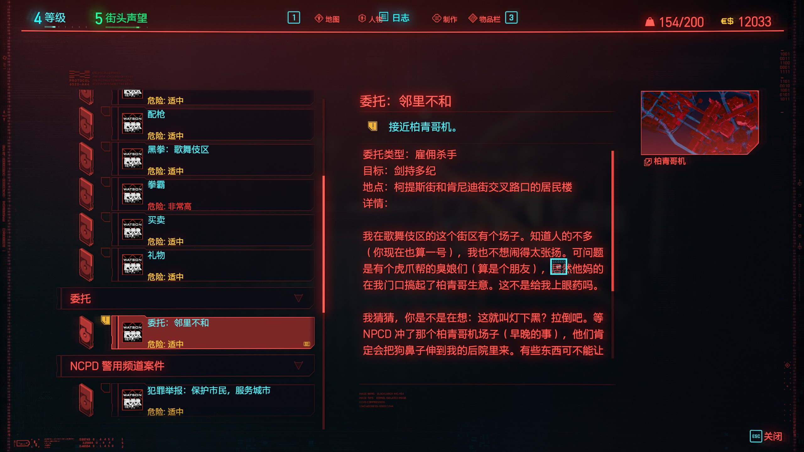
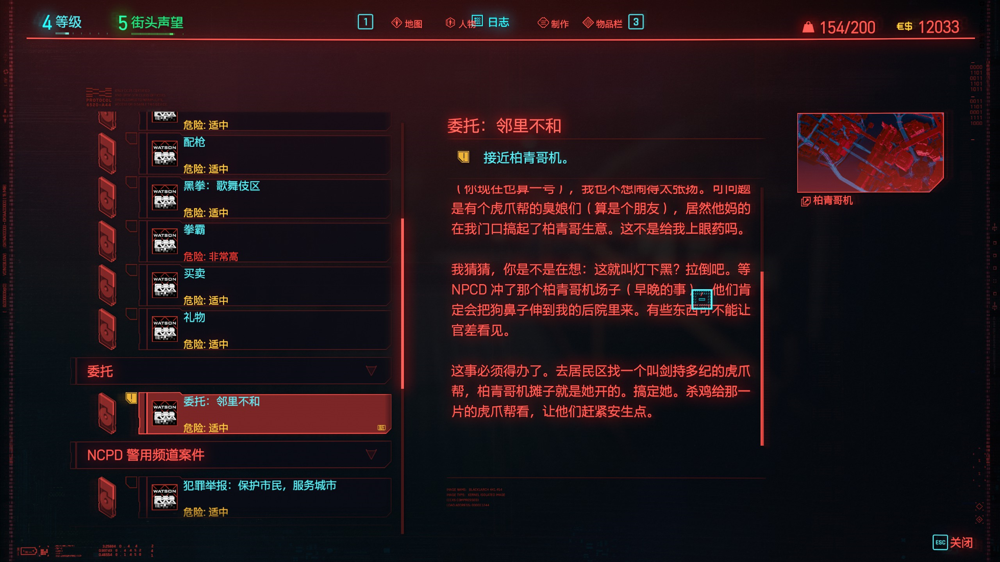
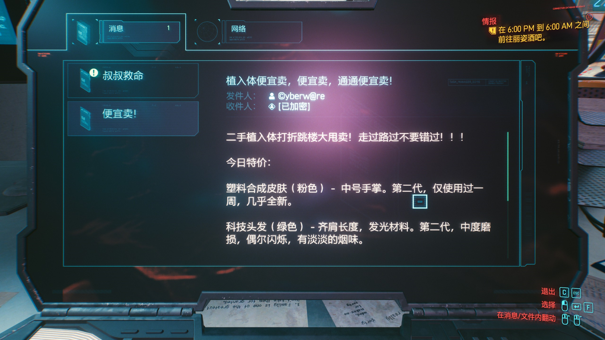
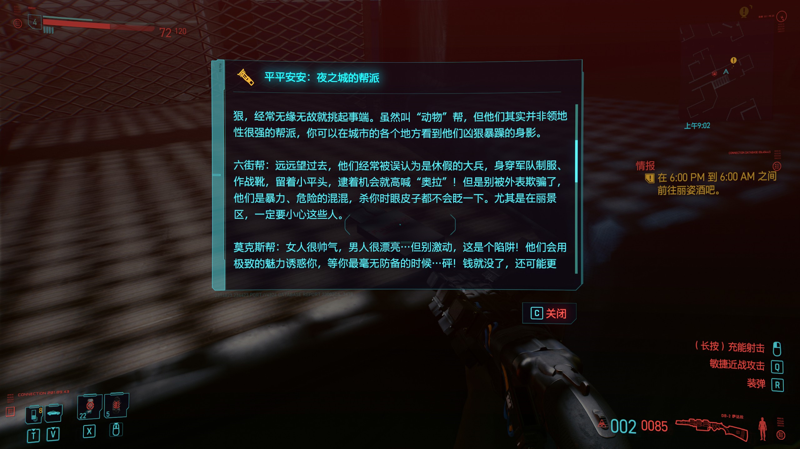
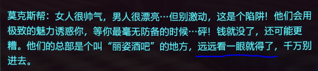
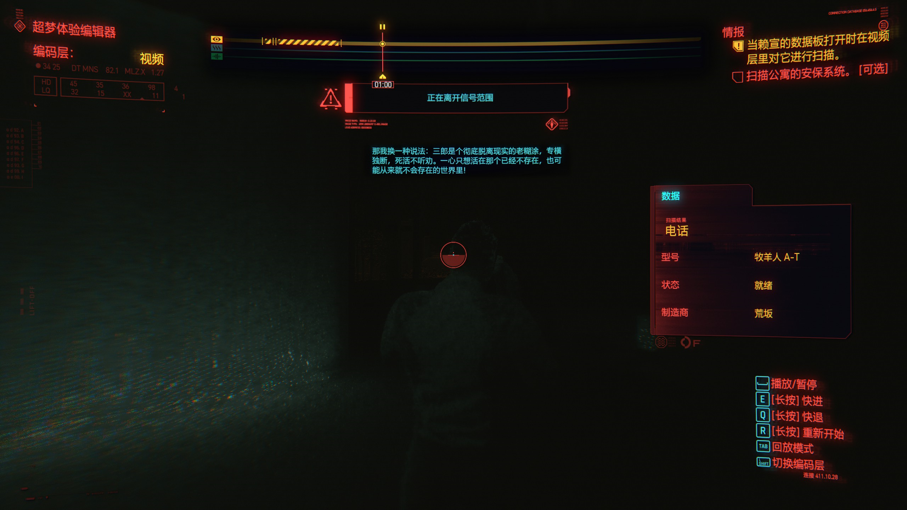
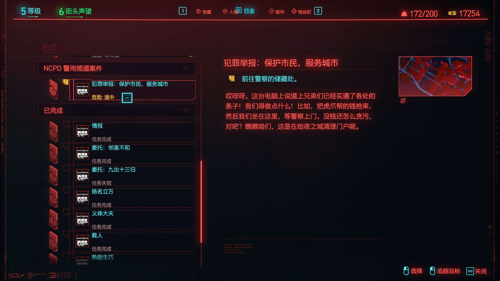

# 问题

##　二零二零十二月二十三号

我也不想闹得太张扬
我不想泰斗人知道
闹得 = Here it's like to make a rucus but in the context of people finding out
张扬 = to make known (让人知道)
算是 = here it means that they could be called friends
反问句 = rhetorical question
这不是给我上眼药吗？ - this is a rhetorical question. Getting eye drops when you don't need them is bad so it's a lot like saying, "Isn't that a kick in the pants?"

这就叫灯下黑 - This is a bit of an analogy. He's saying that because it happened very close to him (on his doorstep), he should have known (he is the light here), but he didn't see it - it's a dark spot.

Update: It's an ancient chinese meaning - you have to know that right below the lantern is a dark spot. Because the lantern is hanging the dark spot is directly beneath and around is light

拉倒吧 - this is a less polite way of saying, "forget it" 算了

早晚 - sooner or later

官差 - police
我是必须得办了 - We have to resolve this. Here 必须得 is all one word. They used the le because it can alse be used to indicate a rapidly occurring action in the near future.
摊子 - here it's the same as 场子 - it's like a place of business

搞定她。 - Kill her
搞定<X> - you can use it more generically. Ex: 搞定程序

杀鸡儆猴 - you have to let the monkey see you kill the chicken. They shortened it to 杀鸡 - it means you have to shoot one in the herd.

安生 - this means they'll be quiet. The tiger gang will see you kill these people and quiet down.

- 二手 = second hand
- 跳楼大甩卖 = The price is so low the boss wants to kill himself.
- 错过 = to miss (you can't miss it)
- 十块钱一个，买不了吃亏，买不了上当 - 10 [dollars] is so little that "you can't buy [loss/shame/etc]". That is to say it can't possibly be a loss because the amount is so little.
- 粉色 = pink
- 中号 = middle size
- 齐肩 = shoulder length
- 闪烁 = flickering/twinkling
- 淡淡 = slight
- 烟味 = smell of smoke

无缘无故 = no reason
挑起 = cause problems
事端 = disturbance/incident
但他们趋势并非并领地性很强的帮派 = 领地性 is like the tendency to stay in one place. It's saying you can find them everywhere.
留着小平头 = hairstyle, like a short haircut - only a little bit of hair is left
逮着 - to catch/arrest 
暴力 - violent
混混 - hoodlum kinda thing. Maybe they don't have jobs, get in fights with other people. That sort of thing.
杀你是眼皮子都不会眨一下 - They kill you and don't even blink

See above

过去二十年，我们两个谁都看不上谁，现在也一样
那我换一种说法 - I'll say it in another way
糊涂 - senile
专横独断 - 专横 is tyranical/dictatorial and 独断 is to decide without consulting others. Combined they form a common Chinese phrase.
劝 - this is to suggest
死活 - has a 无论如何 meaning. Doesn't matter what happens
死活不听劝 - live or die he won't listen to a suggestion
一心只想活在那个已经不存在，也可能从来就不会存在的世界里 - He only wants to live in the world that doesn't exist [now] and probably never did

道上 - this is a derivative of 黑道，白道 - basically like the two worlds. In ancient China there were many gangs. One could say they were 民间 - among the people. When talking about being among the people you could say 道上. Here it is a substitute for the word 帮派 (gang).

条子 - slang for cop. It comes from underground gambling in ancient china. They needed an unrelated word so when the cops would come they would say 条子来了 (paper strip comes)

贪污 - to be corrupt/corrupt/embezzled money

这是在给也称清理门户呢 - it's referring to ourselves. It's like we're the cleaners of the city. 门户 is kind of a euphamism for the city