# Jack Video

不能赶紧的的吗

8 seconds - 忧心忡忡 worried

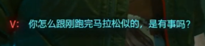
马拉松 - marathon

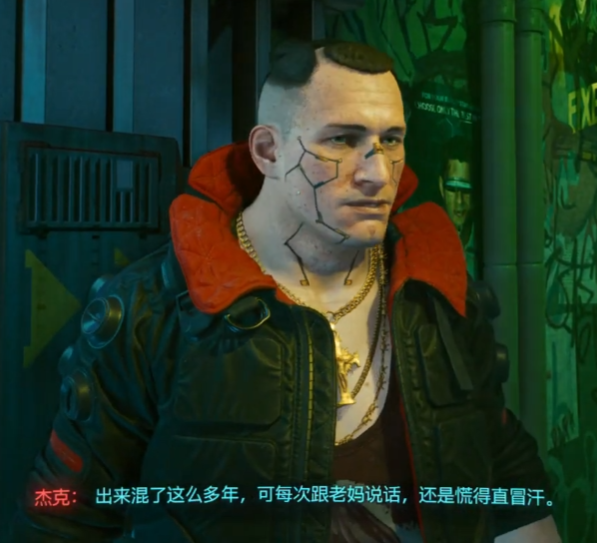
混混 - the hoodlums
老妈 - mom

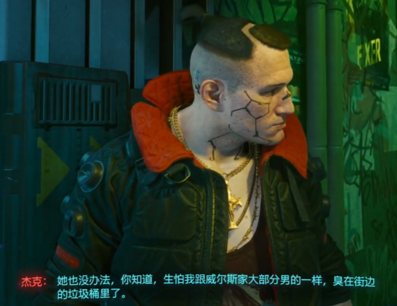

生怕 - 害怕 meaning

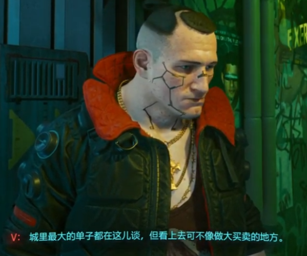

单子 - here it is a business

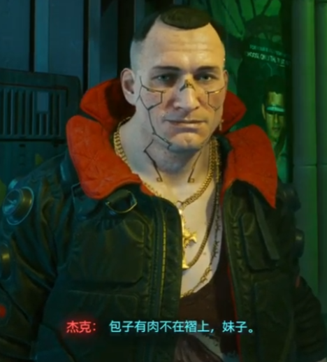

褶子 - the top of dumpling
He's saying that the meat is inside the dumpling (you can't judge a book by its cover)

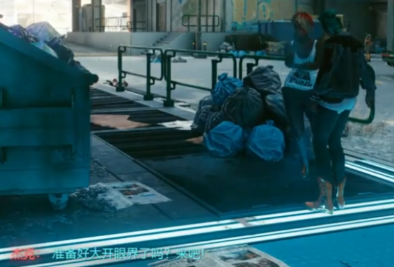

大开眼界 - open your eyes to the world

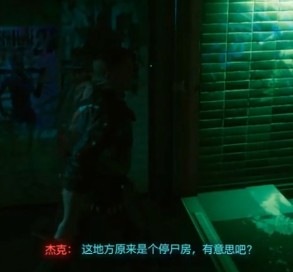

停尸房 - morgue

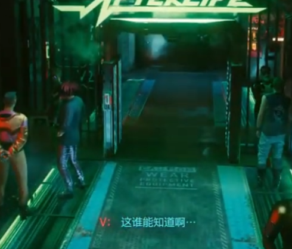

This who can know? (referring to him talking about afterlife)

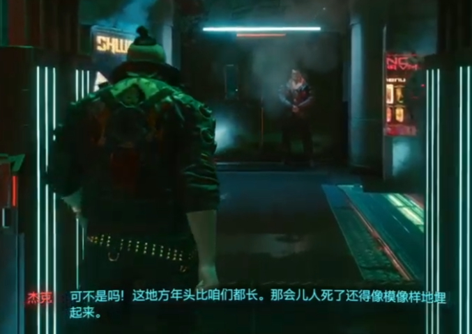

年头 - history

像模像样 - solemn / presentable / decent

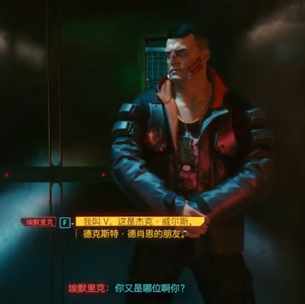

你又是哪位？ = Who are you. However, with the 又 it is emphasizing an "again" sort of meaning. In that there was another stranger before me.

德肖恩 - name

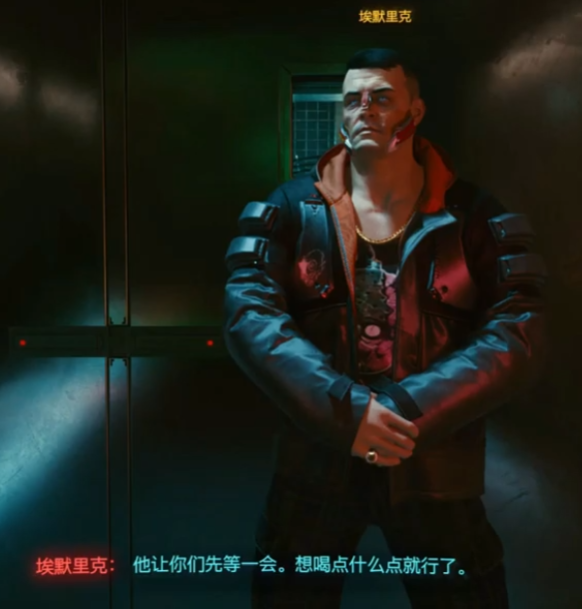

This is saying he (Dexter) wants you to wait a bit. Have a drink.

The first dian is a bit, but the second 点 is not a point/place/a bit - it's a verb. To order

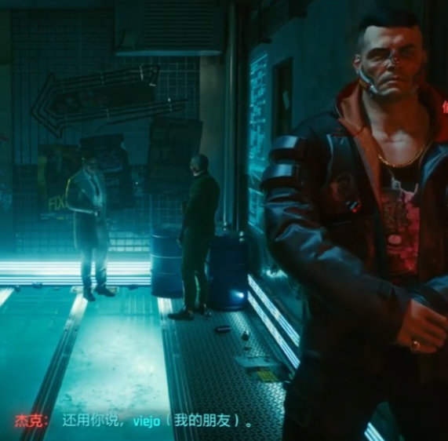

还用你说 - here 还 is more like 不 meaning. He's saying it's not necessary that you tell me.

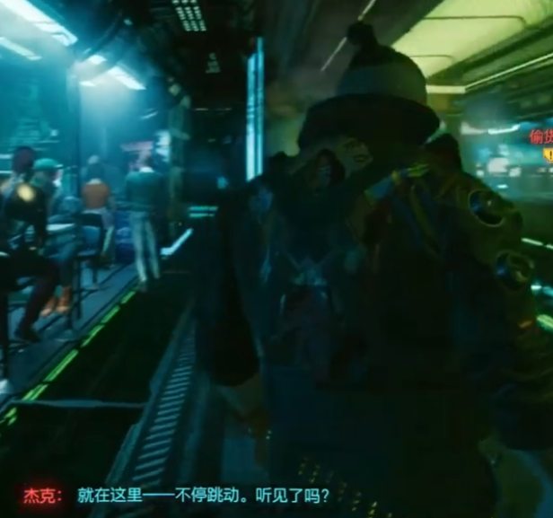

Here he's saying that the heart beats non-stop 不停. 跳动 - heart beat

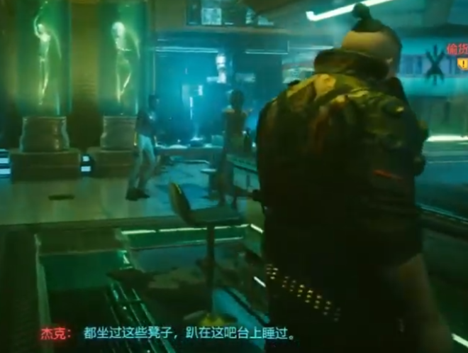

凳子 - stool
吧台 - bar counter
趴 - to lean over

He just finished listing names - he's saying all these famous people have slept on this counter [after getting drunk]