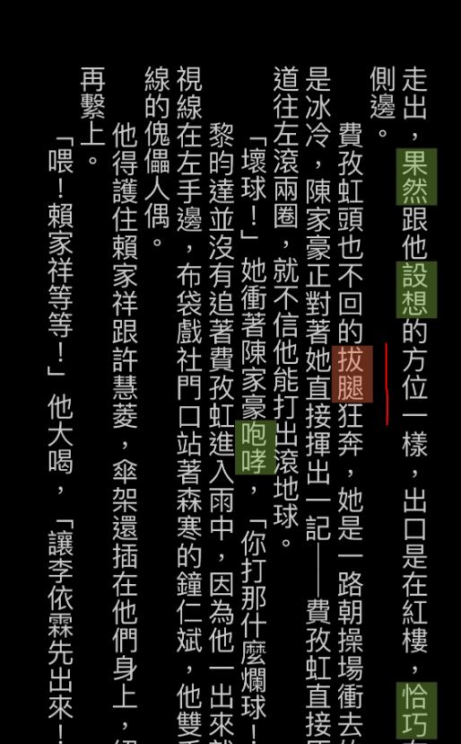
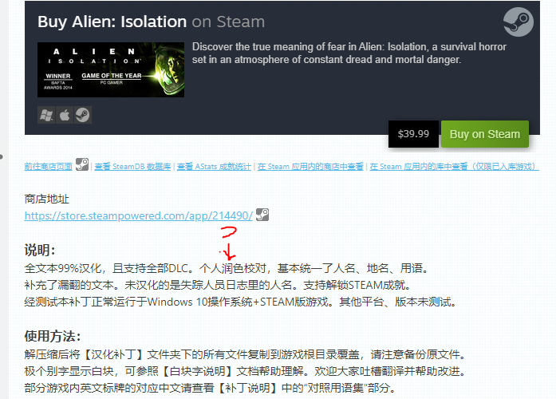

- [x] 
- [x] 
- [x] 
- [ ] 
- [ ] 
- [x] 
- [x] 
- [x] 
- [x] 
  - This one is just a bit weird. It says exactly what it looks like. The shapeless one and you work together.
- [x] 
- [x] 
- [x] 
- [x] 
- [x] 
- [x] 
- [x] 
- [ ] 
- [ ] 
- [ ] 
- [ ] 
- [ ] 
- [ ] 
- [ ] 
- [x] 
- [x] 
- [ ] 
- [x]  You can recall your sailors on land to fight for you
- [ ] 
- [x] 
- [ ]  第二个句子
- [ ] 